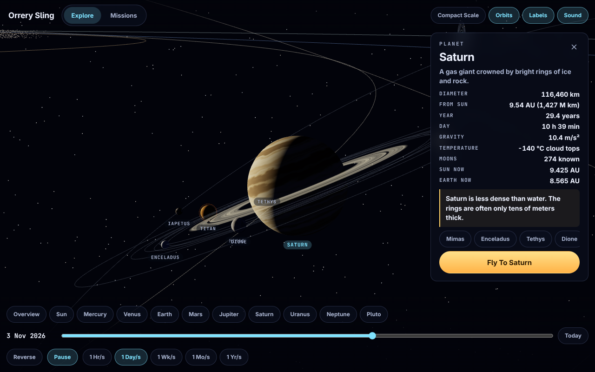

# Orrery Sling

A pocket solar system you can fly through, plus a slingshot game where gravity is your engine.

Every planet and 21 major moons move on their real orbits. Scrub the date, fly to any world, and read its facts. Then switch to missions: aim a probe, pick a launch day, and steal speed from passing planets to reach targets your fuel tank could never reach alone.

Runs in any modern browser. No login, no backend, no downloads. Every texture and sound is generated in code.

## Play

```bash
bun install
bun run dev
```

Open the URL that Vite prints. The project uses Bun, and `bun.lock` is the only lockfile.

## Modes

### Explore

- All 8 planets, Pluto, the Sun and 21 major moons
- Positions come from real orbital elements, so dates line up with the real sky
- Date slider from 1900 to 2050 (the range the orbit formulas are fitted for), five time speeds, reverse and pause
- Click or tap any world for facts, live distances and a fly-to camera
- Compact scale (fits on screen) or true scale (real distance ratios)

### Missions

Six missions, each scored out of three stars.

| Mission | Target | Twist |
|---|---|---|
| First Hop | Mars | Learn to lead a moving target |
| Inward Bound | Venus | Slow down to fall toward the Sun |
| Giant Leap | Jupiter | A long coast across the asteroid belt |
| Ring Run | Saturn | Not enough fuel. Needs a Jupiter flyby |
| Sun Skimmer | Mercury | Not enough fuel. Brake with a Venus flyby |
| Grand Tour | Neptune | Chain the giants to reach the edge |

How a mission works:

1. Set launch day, direction and power. The dotted line forecasts your path: the whole trip in Mission 1, only the start after that
2. The gold ring shows where the target will be when you pass closest
3. Launch, then coast. Planets bend your path as you fly by
4. Use thrusters for small corrections. They burn the same fuel as launch
5. Enter the green ring around the target to win

Score comes from arrival, fuel saved, speed and flybys. Best scores are saved in the browser.

## Controls

| Action | Keyboard and mouse | Touch |
|---|---|---|
| Look around | Drag | Drag |
| Zoom | Scroll | Pinch |
| Select a world | Click it or its label | Tap |
| Jump to a planet | `1` to `9`, `0` for the Sun | World chips |
| Play or pause time | `Space` | Pause button |
| Time speed | `[` and `]` | Speed chips |
| Reverse time, today | `R`, `T` | Buttons |
| Orbits, labels, overview | `O`, `L`, `H` | Buttons |
| Aim direction | `A` `D` or arrows, or drag the gold handle | Sliders or gold handle |
| Aim power | `W` `S` or arrows | Slider |
| Launch day | `Q` `E` | Slider |
| Launch | `Space` or `Enter` | Launch button |
| Thrusters in flight | `W` `A` `S` `D` or arrows | Thruster pad |
| Time warp, chase cam | `F`, `C` | Buttons |
| Restart mission | `R` | Restart button |
| Back to missions | `Esc` | Missions tab |
| Mute | `M` | Sound button |

Hold `Shift` while aiming for bigger steps.

## Screenshots

| | |
|---|---|
| 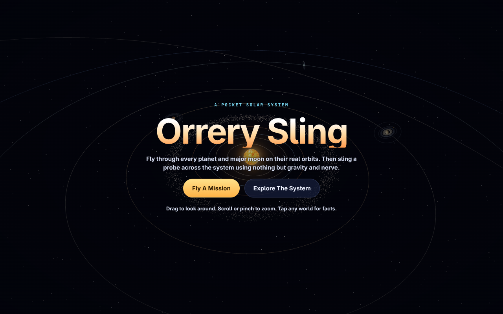 | 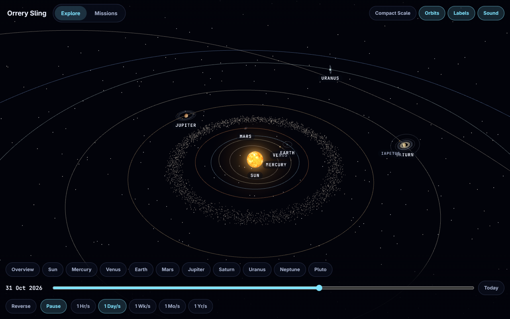 |
| 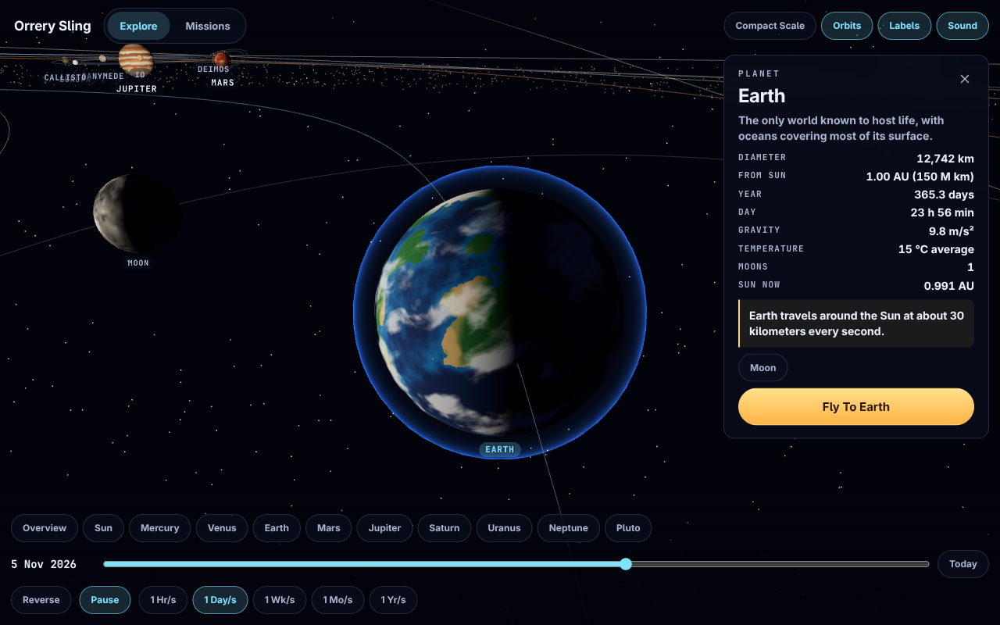 | 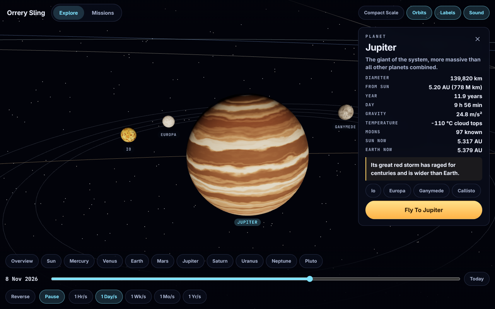 |
| 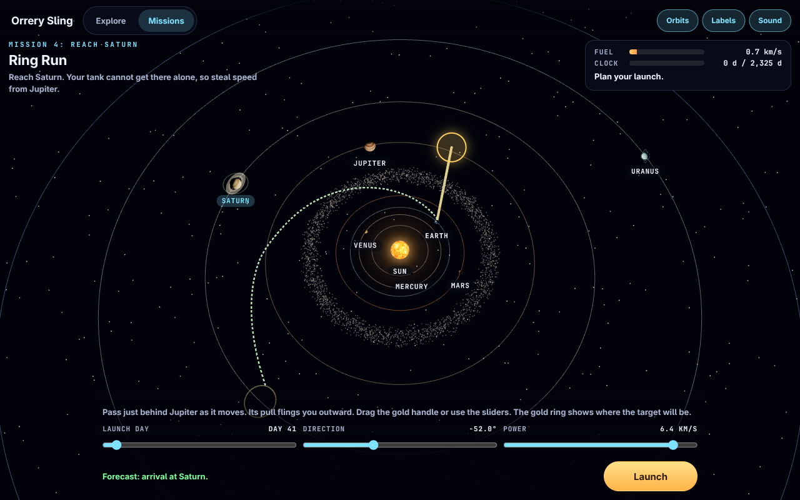 | 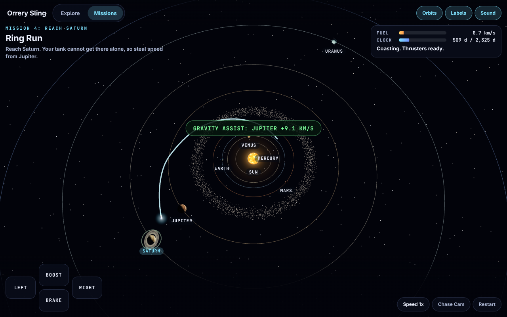 |
| 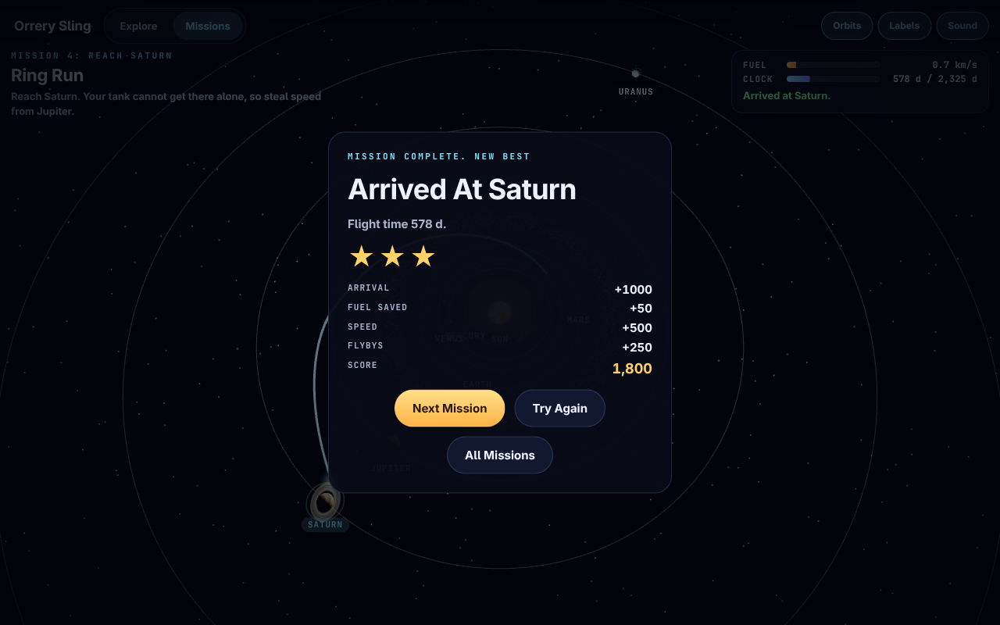 | 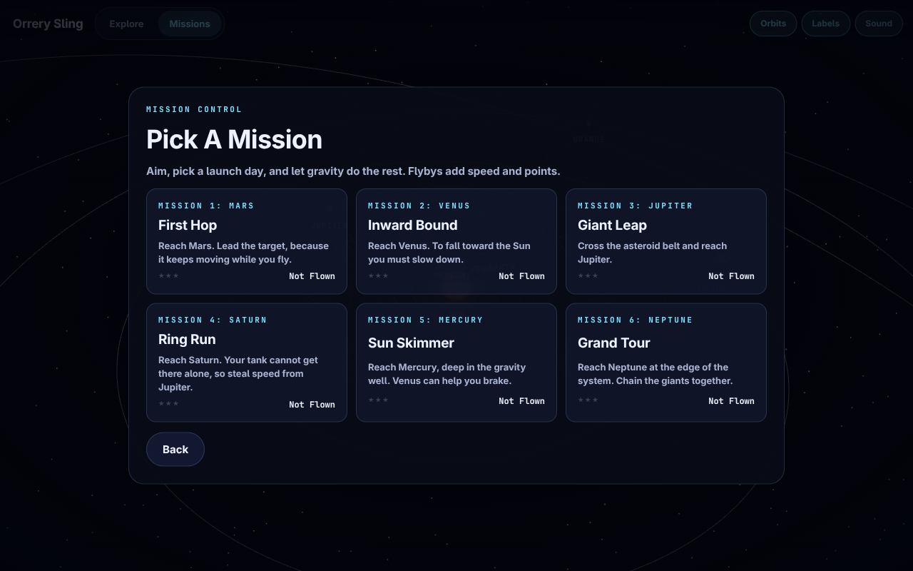 |

On a phone:

| | | |
|---|---|---|
| 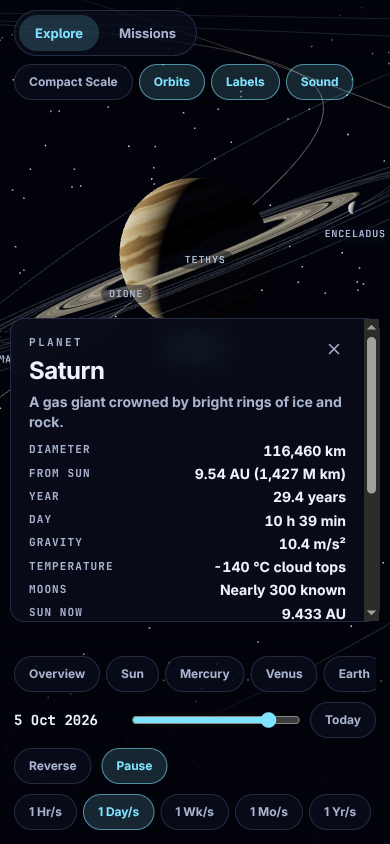 | 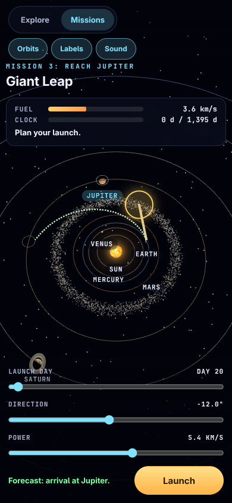 | 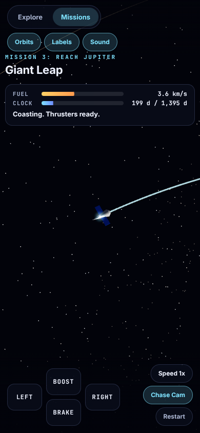 |

## Scripts

| Command | What it does |
|---|---|
| `bun run dev` | Start the dev server |
| `bun run build` | Typecheck and build static files into `dist/` |
| `bun run preview` | Serve the built `dist/` locally |
| `bun run test` | Run the unit tests |
| `bun run solve` | Search for winning launches, used to tune missions |

## How It Works

- **Orbits**: Keplerian elements with century rates (the standard approximate planet positions), solved with Newton iteration. Tests check real events, such as the Mars opposition of October 2020 and the Jupiter and Saturn conjunction of December 2020
- **Moons**: real periods and real order, on circular orbits in the right plane. Uranus moons circle its tipped equator and Triton runs backward
- **Scale**: sizes are exaggerated so small worlds stay visible. Compact scale squeezes distance with a power law and true scale keeps it linear
- **Mission physics**: a probe under the pull of the Sun and eight planets on rails, integrated with fourth order Runge-Kutta at a fixed step. Planet gravity is boosted so flybys bend the path on screen
- **Fair missions**: unit tests fly a known winning launch for every mission, and prove the assist missions cannot be won on fuel alone
- **Art**: planet textures are painted from seeded 3D noise in slices, so frames never stall. The Sun is a shader
- **Sound**: oscillators and filtered noise through WebAudio

## Project Layout

```
src/
  sim/      orbit math, time and scale (pure, tested)
  game/     mission physics, levels, scoring, progress (pure, tested)
  data/     planets, moons and facts
  render/   Three.js scene, textures, camera, mission visuals
  ui/       HUD, labels, thruster input
  audio/    sound effects
  app/      explore and mission controllers
scripts/    level solver
```

## Stack

Vite, TypeScript, Three.js, Vitest. One runtime dependency.

## License

MIT
